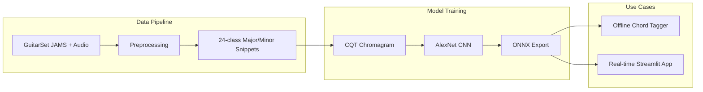

# Harmony Finder — Automatic Guitar Chord Recognition

**A Comparative Study of Deep Learning and Template-Based Methods**

This project processes the [GuitarSet](https://guitarset.weebly.com/) dataset to build a high-quality 24-class chord recognition pipeline. We train an AlexNet-based classifier on CQT chromagrams and achieve strong results (~80.7% accuracy) while comparing against a classical pattern-matching baseline (~60.2%). The trained model powers two practical use cases: **offline chord annotation** of audio files and **real-time chord detection** from a microphone or system audio.

---

## Overview



**Flow summary:** GuitarSet annotations and audio → preprocessing into 1-second snippets → 80/10/10 train/val/test split → CQT chromagram representation (12 pitch classes) → AlexNet classifier → ONNX export → offline tagging and real-time detection.

---

## Results

| Method | Accuracy | F1 (Macro) |
|--------|----------|------------|
| **Pattern matching** (template-based) | 60.24% | 0.578 |
| **AlexNet + CQT chromagram** (best, v10) | **80.71%** | **0.789** |

The pattern-matching baseline uses music-theory chord templates (major/minor), `chroma_stft`, KL-divergence scoring, and median filtering. It achieves a respectable result, which **confirms that chromagrams are a meaningful representation** for chord recognition. The CNN further learns discriminative patterns from CQT chromagrams and improves accuracy by ~20 percentage points.

A critical finding: replacing CQT chromagrams with spectrograms in the CNN (experiment v14) causes accuracy to collapse (~6%), showing that **chromagram representation is essential** for this task.

---

## Repository Structure

| Path | Description |
|------|-------------|
| [`guitarset/code/process-guitar-set-chord-recognition.ipynb`](guitarset/code/process-guitar-set-chord-recognition.ipynb) | Dataset preprocessing: JAMS → 24-class snippets, splits, augmentation |
| [`guitarset/code/inspect_dataset.ipynb`](guitarset/code/inspect_dataset.ipynb) | Dataset inspection, chord inventory, split summaries |
| [`guitarset/annotation/`](guitarset/annotation/) | GuitarSet JAMS chord annotations (360 files) |
| [`guitarset/chords/snippet_summary.json`](guitarset/chords/snippet_summary.json) | Per-class train/val/test counts and durations |
| [`models/cnn_alexnet/alexnet_model.py`](models/cnn_alexnet/alexnet_model.py) | AlexNet chord classifier architecture |
| [`models/cnn_alexnet/cnn-model_v5.ipynb`](models/cnn_alexnet/cnn-model_v5.ipynb) … `v14` | Training experiments (best: **v10**) |
| [`models/cnn_alexnet/offline_chord_tagger.py`](models/cnn_alexnet/offline_chord_tagger.py) | CLI for chord annotation of audio files |
| [`models/cnn_alexnet/realtime_app.py`](models/cnn_alexnet/realtime_app.py) | Streamlit app for real-time chord detection |
| [`models/pattern_matching/pattern-matching.ipynb`](models/pattern_matching/pattern-matching.ipynb) | Template-based baseline |
| [`models/n_gram_chord_progression/ngram_model.py`](models/n_gram_chord_progression/ngram_model.py) | Trigram chord-progression predictor (Jelinek-Mercer smoothing) |

---

## Dataset

The repository includes GuitarSet **annotations** and derived metadata. Raw GuitarSet audio is **not** committed; it must be obtained separately. The preprocessing notebook expects audio paths that may be configured for local or Kaggle-style paths (see [Limitations](#limitations--reproducibility)).

- **Task:** 24 chord classes (12 roots × major/minor)
- **Split:** 80% train, 10% validation, 10% test
- **Window:** 1 second at 44.1 kHz
- **Representation:** CQT chromagram (12 pitch classes, 7 octaves)

---

## Model

**Input:** 1 s mono audio @ 44.1 kHz → CQT chromagram (`librosa.feature.chroma_cqt`) → resized to 227×227 RGB image → ImageNet-style normalization.

**Architecture:** AlexNet-style CNN (5 conv blocks, 4096→4096→24 fully connected) from [`alexnet_model.py`](models/cnn_alexnet/alexnet_model.py).

**Best configuration (v10):** Vanilla AlexNet + CQT chromagram + gentle pitch-safe augmentation (time stretch ±5%, volume ±15%, time shift ±5%). No noise, reverb, or distortion.

---

## Baseline: Pattern Matching

The baseline in [`pattern-matching.ipynb`](models/pattern_matching/pattern-matching.ipynb) uses:
- 24 chord templates (major/minor) as 12-dimensional binary masks
- `chroma_stft` from raw audio
- KL-divergence between observed chroma and templates
- Median filtering over time for stability
- Argmin decoding to chord labels

Its ~60% accuracy demonstrates that chromagrams capture chord information well; the CNN then learns finer structure and improves performance.

---

## Usage

### Offline Chord Tagging

Annotate an audio file with timestamped chord segments (requires a trained ONNX model in `models/cnn_alexnet/results/<version>/`):

```bash
python models/cnn_alexnet/offline_chord_tagger.py song.wav -o chords.txt --version v10
```

Options: `--hop` (default 0.25 s), `--median-kernel` (default 5), `--confidence-threshold` (default 0.3).

### Real-time Chord Detection

Run the Streamlit app (requires ONNX model and optionally `ngram_model.pkl` for chord recommendations):

```bash
streamlit run models/cnn_alexnet/realtime_app.py
```

Connect a guitar via microphone, or capture system audio on Windows by enabling **Stereo Mix** or installing [VB-Audio Virtual Cable](https://vb-audio.com/Cable/).

### N-gram Chord Recommendations

Train the trigram model from GuitarSet accompaniment annotations:

```bash
python models/n_gram_chord_progression/ngram_model.py
```

This produces `ngram_model.pkl`, used by the real-time app for next-chord suggestions.

---

## Setup

There is currently no `requirements.txt` or `pyproject.toml`. The following packages are inferred from imports and notebook usage:

```
numpy pandas matplotlib tqdm scipy librosa jams soundfile
torch torchvision scikit-learn
onnxruntime streamlit sounddevice Pillow
```

Suggested install:

```bash
pip install numpy pandas matplotlib tqdm scipy librosa jams soundfile torch torchvision scikit-learn onnxruntime streamlit sounddevice Pillow
```

Python 3.10+ recommended. For training, run the CNN notebooks (`cnn-model_v10.ipynb` is the best configuration); they export ONNX and config to `models/cnn_alexnet/results/<version>/`.

---

## Recommended Starting Points

| Goal | Start here |
|------|------------|
| Inspect the dataset | [`guitarset/code/inspect_dataset.ipynb`](guitarset/code/inspect_dataset.ipynb) |
| Build the chord snippets | [`guitarset/code/process-guitar-set-chord-recognition.ipynb`](guitarset/code/process-guitar-set-chord-recognition.ipynb) |
| Train the CNN | [`models/cnn_alexnet/cnn-model_v10.ipynb`](models/cnn_alexnet/cnn-model_v10.ipynb) |
| Run offline tagging | `python models/cnn_alexnet/offline_chord_tagger.py <audio.wav>` |
| Run real-time demo | `streamlit run models/cnn_alexnet/realtime_app.py` |

---

## Limitations & Reproducibility

- **Trained artifacts:** ONNX models (`alexnet_chord_classifier.onnx`) and `ngram_model.pkl` are expected by the apps but are **not** committed. You must train and export them via the notebooks/scripts.
- **Paths:** Some notebooks use Kaggle-style paths (`/kaggle/input/...`). For local runs, update paths in the notebooks to match your GuitarSet location.
- **Audio source:** GuitarSet audio must be obtained from the official [GuitarSet](https://guitarset.weebly.com/) site; the repo contains only annotations and derived metadata.

---

## Reference

Project report: [`automatic_chord_recognition_group_4.pdf`](automatic_chord_recognition_group_4.pdf) — *Automatic Guitar Chord Recognition: A Comparative Study of Deep Learning and Template-Based Methods* (by Amar, Luis and Ben).
